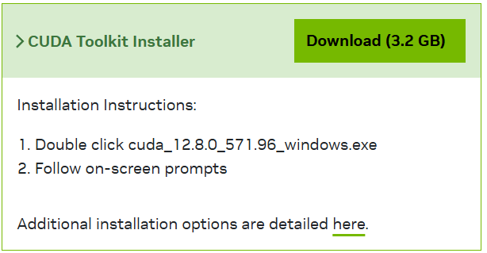
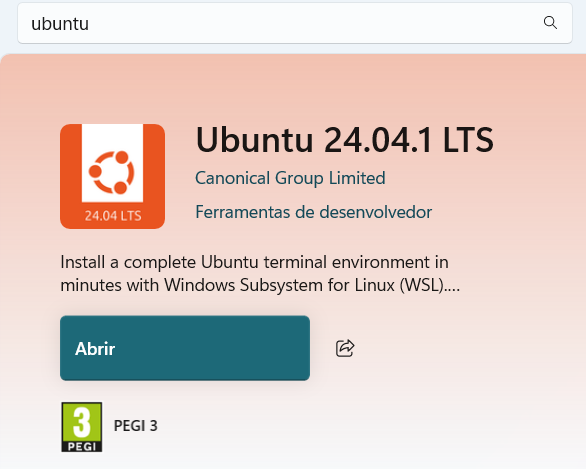
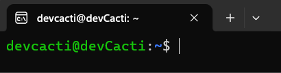
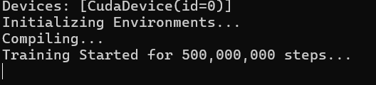
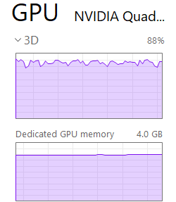
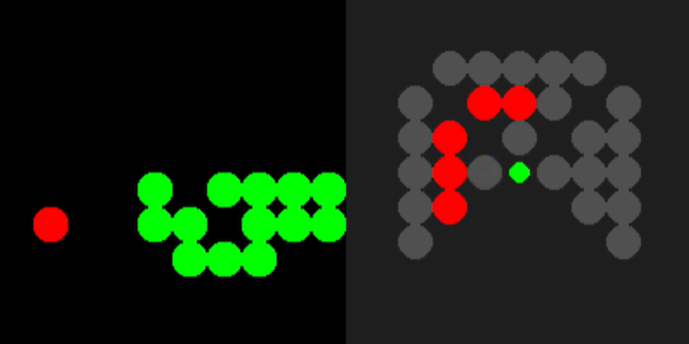

# Snake AI

Another attempt **(#2)** at creating an **AI Snake Agent** that is capable of filling an entire game board on its own.

**If you wish to run training on your computer, I recommend you make sure you have no thermal issues.**

The training code will easily reach 100% on your GPU if you push training to use as much GPU as you have. The training code is so efficient that I got my GPU to reach >85ºC.

# Setup Guide

## Requirements

> The installation of the python libraries listed below will be explained in the setup guide.

- Python 3.12.3 (If you use WSL, this should be installed by default)
  - JAX [Cuda 12]
  - FLAX
  - OPTAX
  - Pillow
- WSL 2 - Ubuntu (The guide focuses on WSL Setup)

## Optional Requirements (Recommended)

> Please note that the following recommendations are based on what I use and is working for me, things could be different for other systems. In theory you don't need any of this to run training or replays.

- **NVIDIA GPU** - _The more VRAM and Cores the better_
- **CUDA Toolkit 12.8** - _Python might install this, but it wasn't tested_
- **Cudnn 9** - _Python will install this, check the setup guide_
- **Visual Studio Code** - _This is my recommendation, if you wish, you can use a different IDE_

### **This guide assumes you are using Windows 10/11**

> **This setup guide will also assume you run every command as written here**. With exceptions to those where you should be the one writing the command.

> You should be able to just copy and paste most of these commands

## 1. First Steps (If you wish to use the GPU)

> These steps you will have to do on your own.

Go to **NVIDIA's Cuda Toolkit** Website and download **Cuda Toolkit 12.8**, this is one of the most important steps in order to use your GPU, **you have to have an NVIDIA GPU** though, pretty sure AMD GPUs don't work for this.

Here is the link for [Nvidia's Cuda Toolkit 12.8](https://developer.nvidia.com/cuda-12-8-0-download-archive?target_os=Windows).

Then follow the instructions on the website.



## 2. Enabling and Installing WSL2

To enable WSL2 you have to **make sure you have virtualization enabled** on your PC. And then you might ask:

> "_Why not a Virtual Machine then?_"

Well, I never managed to get GPU usage inside a virtual machine and WSL2 gets it without needing any setup.

To be honest I don't even remember how I installed WSL.

Run the following command on PowerShell, when it's done **restart** your PC.

```ps
wsl --install
```

Alternatively, you can also use the Microsoft Store. Just make sure it says something along the lines of "WSL", the one I recommend is **Ubuntu 24.04.1LTS**.



You know you can use WSL as soon a command prompt appears with a Linux Ubuntu setup prompt after you run the following program:


It also works if you run `wsl` on a command prompt.

## 3. Setting Up the Project

With every requirement checked, we can start actually setting up this repository for it to work properly.

> Please do not skip any steps.

### 3.1. Open WSL

Make sure you have the WSL prompt open. It should look something like this:



### 3.2. Clone the Project

You should create a folder to place the project, so first run the following commands:

```bash
# To create a folder
mkdir devcacti_projects

# To move into the new folder
cd devcacti_projects
```

After that you can run the clone command and then go inside the repo:

```bash
# Clone
git clone https://github.com/devCacti/snake-ai.git

cd snake-ai/
```

**If you are not able to run this command due to not having git, run:**

```bash
# This might ask for a password
sudo apt update && sudo apt install git -y
```

---

If you wish to know what it will look like, this is what it should look like in theory, or at least close to this:

```bash
# Folder
devcacti@devCacti:~$ mkdir devcacti_projects
devcacti@devCacti:~$ cd devcacti_projects/

# Clone
devcacti@devCacti:~/devcacti_projects$ git clone https://github.com/devCacti/snake-ai.git
Cloning into 'snake-ai'...
remote: Enumerating objects: 14, done.
remote: Counting objects: 100% (14/14), done.
remote: Compressing objects: 100% (11/11), done.
remote: Total 14 (delta 2), reused 14 (delta 2), pack-reused 0 (from 0)
Receiving objects: 100% (14/14), 1.05 MiB | 1.82 MiB/s, done.
Resolving deltas: 100% (2/2), done.

# Check
devcacti@devCacti:~/devcacti_projects$ ls
snake-ai

# Move into the folder
devcacti@devCacti:~/devcacti_projects$ cd snake-ai/
devcacti@devCacti:~/devcacti_projects/snake-ai$
```

### 3.3. Create a Python Virtual Environment

You could skip this part, but I genuinely do not recommend.

This is the sequence of commands you should run before you create a _venv_:

```bash
# To make sure everything is up-to-date
sudo apt update

# WSL doesn't come pre-loaded with the tools to create virtual environments
sudo apt install python3-venv -y
```

Now create and use the virtual environment.

```bash
# This creates a virtual environment with the name venv
# python3 -m venv is the command, the other venv is the name
python3 -m venv venv

# Activate the virtual environment
source venv/bin/activate
```

Once you do these steps, at the start of the line, there should be a text saying `(venv)`, just like so:


### 3.4. Install all the required Python libraries

The required libraries are `JAX`, `FLAX` and `OPTAX`, however, if you do `pip install jax flax optax` you will install the very wrong version of JAX. You will end up installing the version of JAX that doesn't use the GPU, it will work, just not on the GPU.

Here is the command you should run instead:

```bash
pip install --upgrade "jax[cuda12]" flax optax pillow
```

This command will install all the required libraries, when installing jax, all the related libraries, including NumPy will be installed.

### 3.5. Run Training

Now that you installed everything, you should be able to run training, I do however recommend you run training from the `src` folder, as it is the most stable and functional one.

```bash
python3 src/train.py
```

With this simple command, training will start on its own, if you did everything correctly, you should see the following lines appear on the screen:



If you see errors, that means, either the backup isn't functional, which is not supposed to happen (after all, it's a backup) or there is something wrong with the set up. I could have skipped some steps, let me know if you can't do this.

Also, make sure your GPU is the one being used and not the CPU, the CPU should be very chill and not doing much at all during training.



### Let me know if there is anything you want to know or if you can't solve a problem on your end.

### **Before creating an issue, please check if there is already an issue (even closed ones) regarding your problem.**

---

# Previous Attempt (#1)

This repository is made in an attempt to improve what was already done in the following repo:

[Snake-RL | devCacti](https://github.com/devCacti/snake-rl)

That previously made repository was my first attempt at learning concepts in the AI world. Starting off trying to use libraries like **TensorFlow** and **PyTorch**, ended up using **PyTorch** as it allowed me to use GPU power without needing the use of **WSL**.

_Quite ironic huh_.

Don't get me wrong, the previous method already made a pretty capable agent however, not good enough. You can check out [this LinkedIn post](https://www.linkedin.com/posts/tiago-laim_ai-reinforcementlearning-activity-7358916807518220288-yMyv?utm_source=share&utm_medium=member_desktop&rcm=ACoAAE_W0fYBrVrybKNltf4r7K6nzMGxUPRSza4) to see what I mean, even though it's not the latest version of the project, certainly was a successful one.

Yet with the lack of observations the agent had, it could never achieve a completed board in a single run.



### Motives leading to the discontinuation of the project

One of the main reasons to me putting this project to the side was mainly school and career choices. But certainly the most important one was the **lack of motivation**. The way that I was training the agents was so wasteful and ineffective that I started losing any sort of motivation to continue trying to improve.

> _I guess this repository should serve as an example for people to not give up their dreams. **Take your time**._

Before, training consisted in using too much Python logic, which meant that whatever action the GPU decided had to be sent back to the CPU for checks, for example, `If Snake[0] hits wall then reset`. Just the time it took for the information to be sent back the CPU and then to the GPU was so big that the CPU training on its own could probably do it faster.

The fact that I knew that there were ways to have thousands upon thousands of environments running all at the same time and I could never seem to understand how I could do it was also contributing for me to lose some of that motivation, with **PyTorch** I was having about 10 Environments all running at the same time and that was eating about 8GB of RAM, in none of my PCs I have more than 16GB. This was extremely frustrating, the CPU was having more activity than the GPU most of the time and that didn't make sense to me.

I spent quite the time building all these fancy systems to save CheckPoints, organising folders and file structures, all that just to have agents that were too dumb to understand anything besides eating the food on the board.

### This Section

This Sections objective is not to show how the previous system worked, that should have been done by me on the previous repository, which I didn't do a good job at. This is to tell you why it went wrong and why this new Repository was created in the first place. If you do wish to understand what that previous project does, all I can advise you to do is to read the code, surely it still has some comments.
